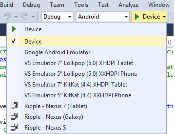
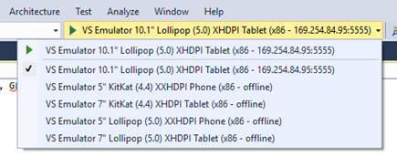
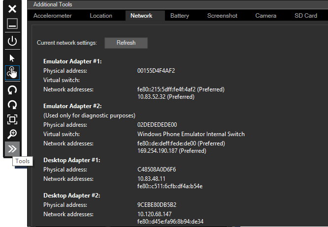
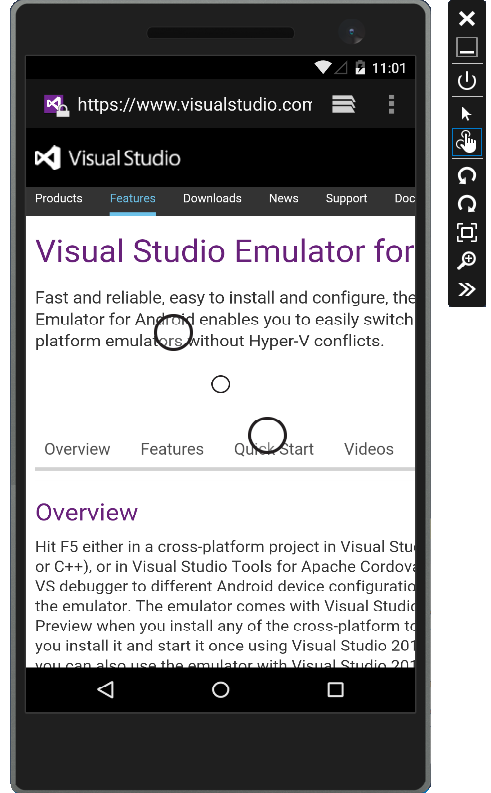
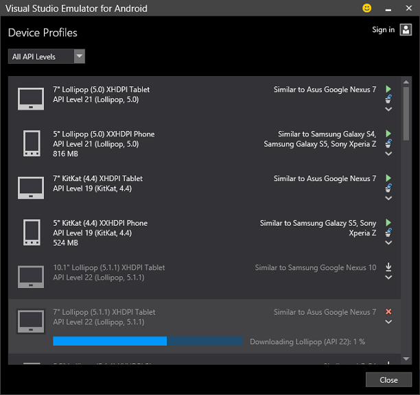

<properties
    pageTitle="Android Emulator"
    description="The Visual Studio Emulator for Android is based on Hyper-V, and is targetable by any Android project with configurable images such as Lollipop and KitKat."
    slug="androidemulator"
    order="400"    
    keywords="visual studio, vs2015, vs, visualstudio, cross-platform, mobile apps, iOS, Android, Windows Phone, Android emulator"
/>

You can use the Visual Studio Emulator for Android either in a cross-platform project in Visual Studio (Xamarin or C++), or in Visual Studio Tools for Apache Cordova. The emulator allows you to switch between different platform emulators without Hyper-V conflicts. It supports a wide variety of sensors and simulations, including GPS/Location, accelerometer, screen rotation, zoom, SD card, installation of APKs, camera, multi-touch, drag-and-drop, power/battery, keyboard input, network access, WiFi simulation, and OpenGL. It also supports Android versions 4.4 (KitKat, API Level 19) and 5.0 (Lollipop, API Level 21). 

## Debugging with the Visual Studio Emulator for Android

When you start debugging, you must first choose a target. That target can be a device, or it can be one of many emulators that you may have running on your machine.  To target the Visual Studio Emulator for Android, you can either select one of the pre-installed device profiles that appear in the Debug Target dropdown or use the Emulator Manager to install and start a different device profile (see the "Device Profiles" section below for more on that method).

Here's how the emulator appears for Cordova, Xamarin, and C++ projects, in that order:

Once you have chosen your debug target and hit F5, your app will be deployed to the emulator, as per the regular VS debugging flow you can hit breakpoints in your code, see the call stack, inspect variables, etc.

## Emulator Capabilities

### Zoom

You can change the size of the emulator as you see it on your development machine (the host). The dots per inch (DPI) for the emulator is based on the host monitor DPI, regardless of the zoom value. This allows you to scale the emulator in case it is taking too much space on your desktop.

To change the size, use the "Zoom" button on the emulator's vertical toolbar.

You can also use the "Fit to Screen" button above the "Zoom" button to fit the emulator on your screen.

If you are going to take screenshots of your app running in the emulator (e.g. with the Snipping tool) for best results remember to set the zoom level to the maximum of 100%, or use the built-in Screenshot tool described later in this topic.

### Orientation / Rotation

Unless your app only supports a fixed orientation, you should test how your app responds to orientation changes, and what it looks like in portrait, left-landscape, and right-landscape orientations. Simply rotate the emulator left or right with the two corresponding buttons on the vertical toolbar: "Rotate Left" and "Rotate Right". The size of the emulator remains the same when you rotate.

### Network Information

The emulator reuses the network connection of the host machine, so there is nothing for you to configure. You can also review the emulator’s current network settings. On the vertical toolbar click on the “Tools” button to show the “Additional Tools” fly out panel, and then click on the “Network” tab.

### WiFi Simulation

Apart from touch, the most commonly-used device feature in Android apps is WiFi. In addition to simulating a network connection over Ethernet, the emulator simulates a connection to a the more common WiFi network scenario.

### Location (GPS)

If your app does anything with navigation, geofencing, walking/biking/driving, then you will love the location and driving simulation in the emulator under the “Location” tab when you open the “Additional Tools”.

You can navigate the map by dragging it around, by zooming/in and out, or even by searching for a location. You can place and remove pins on the map, thus creating **map points**. Those appear as latitude longitude coordinates in the list in the bottom left. From the toolbar at the top you can even save those map points to an XML file and later load them from the file.

Instead of having each map point immediately change the GPS location of the emulator (**“Live” mode**), you have other options too! You may want to place a few map points and then simulate transitioning between those points. To do that, at the toolbar at the top switch from “Live” mode to **“Pin” mode**. Then you can press the small play button at the end of the toolbar to transition between the map points. You can even enter a transition interval (in seconds).

Finally, you can choose a third mode that is similar to “Pin”, which is called **“Route” mode**. In this mode you can also simulate transitions between the points but with some additional twists. The simulator will calculate an actual path between the points and generate invisible points at 1 second intervals between the points you choose. The overall speed at which it will play those points is determined by a second setting and your options are: “Walking” (5 kilometers per hour), “Biking” (25 km/h), “Speed Limit” (variable dependent on map point), and “Fast”.

### Accelerometer

If your app tracks and responds to movement of the phone, you can test them using the “Accelerometer” tab when you open the “Additional Tools”.

Simply click and hold the red dot in the middle and drag it towards the directions you want to simulate, within the 3D plane. As you do that your app will receive movement events if it has registered for them.

You can also see the X, Y, Z values in the bottom left. Under those values you can “Reset” to the starting position, and also pick the starting Orientation from these values: Portrait Standing, Landscape Standing, Portrait Flat, and Landscape Flat.

Lastly you can simulate the phone shaking by clicking the “Play” button in the bottom right. The only visual indication that a shake is taking place are the values of the X,Y,Z and when they stop rapidly changing you’ll know the shake is over.

### Power/Battery Simulation (and Power button)

If you write your app to respond to battery charge changes, then you will like the emulator’s ability to simulate that by switching to the “Battery” tab when you open the “Additional Tools”.

There is a slider that allows you to set the exact charge value of the battery. Notice as you slide down/up how the battery icon in the top right changes to reflect the change. Your app can also respond accordingly.

If you change the Battery Charging State to not be “Charging”, then the emulator’s screen will go blank after a timeout period. You can configure the timeout though the built-in regular "Settings" app (look for the “Sleep” option under “Display”). If the emulator sleeps due to this, then you can wake it up through the “Power” button on the vertical toolbar.

### Screenshot

To take a screenshot of your app, open the “Additional Tools” and switch to the “Screenshot” tab. Then click on the “Capture” button, which will take a screenshot and show you an instant preview. If you want to keep the screenshot click on the “Save…” button. If you don’t like the screenshot you took, ignore it or click “Capture” again.

The screenshot tab will take the image at the same resolution as is displayed on your screen, so make sure to set zoom to 100% for best results.

### Install APKs through drag and drop

You install apps on Android through an application package file which is known as an APK. If you have an APK that you want to install on the Visual Studio Emulator for Android, just drag it onto the emulator from Windows Explorer. You will see a message in the emulator indicating progress “File transfer in progress…” followed by a message box “File foo installed successfully in Android”. Remember to make sure your APKs have code built for x86!

You can also drag and drop other (non-APK) files to the emulator and they will be placed onto the SD Card, which brings us to the next topic.

### SD Card

If your app has a need to read or write to the SD card of the target, the emulator simulates that by making available a folder representing an SD card.

<TODO: move this stuff to how-to docs.>
Note that the Android image uses a separate VHD for SD card support. So if you want to transfer files to/from the SD card on your development machine, you can mount the VHD to Windows: Close the emulator (to shut down the VM), then navigate to the VHD location in Windows explorer, and double click the VHD to mount it. By default the VHD is located under the path:

	%localappdata%\Microsoft\VisualStudioEmulator\Android\Containers\Local\Devices\vhd\[device profile name]\image.sdcard.vhd, where [device profile name] is the name of the Device Profile that you are running.

At this point, the VHD is mounted as an additional drive to Windows and you can use it pretty much like any other drive. Before restarting the emulator you must un-mount the VHD, which you can do by right clicking on the drive and selecting Eject.

Having SD card support in the image also allows other built-in Android apps to function, such as the browser downloads and the camera app – which brings me to the next capability.

### Camera

Typically you’d be using the camera from your app (using an appropriate API), and we support that. You can also use the built-in camera app directly. When you launch the camera in the emulator you will see a fixed animated image that you can take a snapshot of, simulating taking a picture. You can also navigate to the "Camera" tab in "Additional Tools," where you can switch the input for Front and Rear Camera to display a default animation, a picture from file, or an attached webcam. Any webcam recognized by Windows will show up in the dropdown lists for front and rear cameras.

### Multi-touch

If your app makes use of more than one simultaneous touch point (eg. for pinch functionality), you can select between "Single Point Input" and "Multi-touch Input" on the vertical toolbar that appears next to the emulator display.

Selecting "Multi-touch Input" will overlay three dots. The large outer two dots act as touch points for pinching and zooming, and the inner dot controls the origin for the touch points. If you're using the emulator on a touchscreen you can also use your fingers to directly interact with the emulator screen.

### Audio Playback, Keyboard Text Input…

There are other capabilities that the emulator provides that are taken for granted, and three of the most important are: 

- You can use your computer’s keyboard to enter text in the emulator.
- Any audio coming from the emulator can be heard through your computer’s speakers.
- The emulator will appear to be connected to a WiFi network.

## Device Profiles

It's no secret that testing your Android app for compatibility across the staggering variety of Android hardware can be a challenge. Android phones and tablets in the market span a wide range of versions and screen sizes and come in many different hardware configurations (RAM, CPUs, architecture, etc.). Making sure that your app works as expected for the most popular devices on the market can be challenging. The Visual Studio Emulator for Android simplifies this by introducing Device Profiles. A curated set of device profiles represent the most popular hardware in the market, including devices from Samsung, Motorola, Sony, LG, and more. 

In Visual Studio 2015, the Tools > Visual Studio Emulator for Android... brings up the Emulator Manager.

You use the Emulator Manager to install, uninstall, and start device profiles. By default, we've gone ahead and pre-installed four device profiles (KitKat and Lollipop phone/5" and tablet/7" configurations), as indicated by the white text and icons. Other profiles in the list will appear grayed out until you click the "Install Profile" button and the installation completes. You can filter the list by API Level (currently 19 and 21) and click the details arrow on the bottom right-hand side of a profile to view its full configuration details.

Once you've installed the set of profiles that you'd like to target, you can start these new profiles directly from the manager by pressing the green "Play" button.

