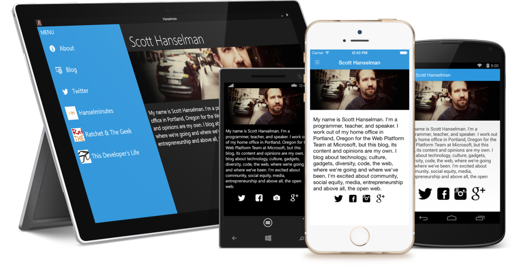
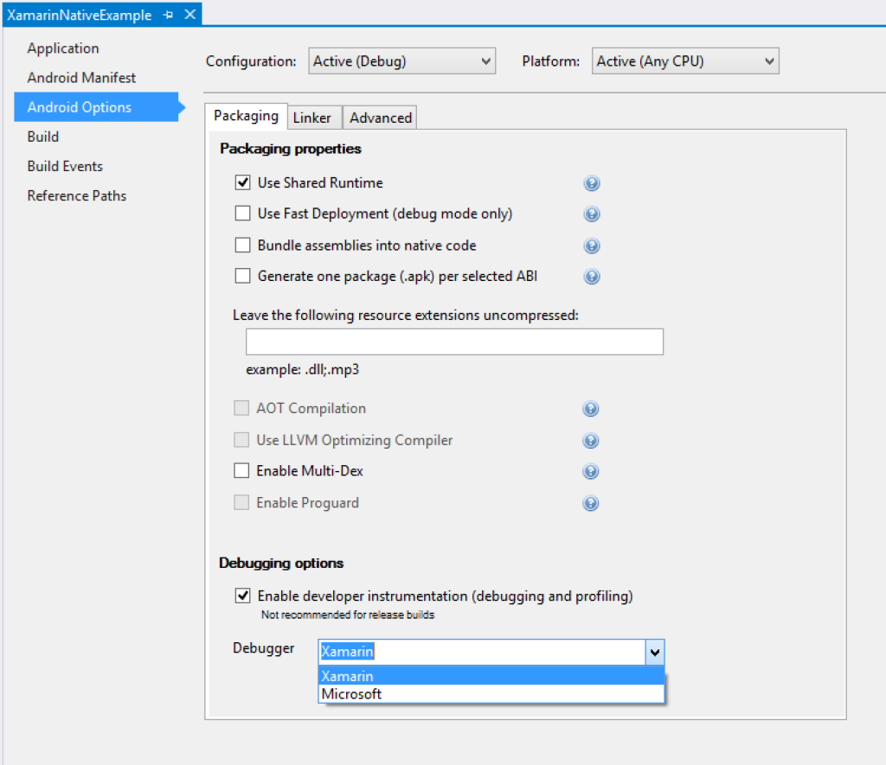

<properties
    pageTitle="Xamarin"
    description="Xamarin tools combined with Visual Studio empowers developers to write and debug fully native cross-platform mobile apps by using C# and .NET, with 75% to nearly 100% shared code across platforms."
    slug="xamarin"
    order="300"    
    keywords="visual studio, vs2015, vs, visualstudio, cross-platform, mobile apps, iOS, Android, Windows Phone, C#, Xamarin"
/>

With [Xamarin](https://www.xamarin.com), developers get the benefits of using C# and .NET and also powerful Visual Studio IDE features like CodeLens and third-party extensions. With code written in C#, developers can leverage a [wide range of application lifecycle management (ALM) tools](https://msdn.microsoft.com/en-us/library/mt162217(v=vs.140).aspx) in Visual Studio as well.

Visual Studio 2015 also includes the free Xamarin Starter Edition, making it easier for developers to get started with Xamarin without the need to install it separately. 

Xamarin issues updates on a separate schedule from Visual Studio; keep up to date on http://blog.xamarin.com/. Here, though, we'll give some highlights that apply to working with Xamarin in Visual Studio 2015.  

## Xamarin.Forms for Windows

Xamarin.Forms support for the Windows platform has been updated to support Windows 8.1, Windows Phone 8.1, and Windows 10 universal apps. This enables developers to build and ship Xamarin.Forms apps targeting all of the major mobile platforms from a single code base. (As of this writing, Windows 10 support was in private preview.)

## Code Completion for Xamarin.Forms XAML

Declarative UI development in Visual Studio gets even more powerful with code completion for Xamarin.Forms. You can easily explore Xamarin.Forms user interface APIs, quickly build complex screens, and avoid typos and other common mistakes while creating UIs in XAML.

## Visual C++ Debugger Integration

You can reference and debug C++ libraries in Xamarin.Android apps. Visual Studio 2015 provides an option to pick which debugger you would like to use when running your Xamarin.Android apps from the project’s property window. Simply choose Microsoft and you will be able to debug through your native C++ library with all of the debug features you know and love, including expression evaluation, watch window, and auto window.

## Enhanced WatchKit Support

The iOS designer in Visual Studio is fully enabled for editing Apple Watch storyboards. Drag interface controllers and UI controls onto the storyboard from the Visual Studio Toolbox and configure properties on the Properties pad and use control + drag to move buttons, tables, or interface controllers onto another interface controller to create segues.watchdesigner-vs

## iOS Binding Projects

When developing iOS projects in Visual Studio, you might encounter cases where you want to consume a third-party Objective-C library. In those situations,  use Xamarin.iOS Binding Projects in Visual Studio to create a C# binding that will allow you to consume the library in your Xamarin.iOS apps.
