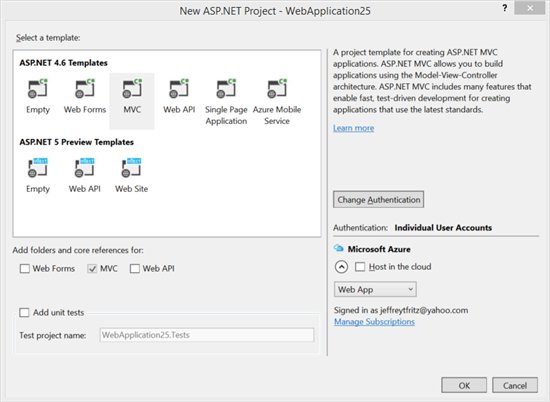
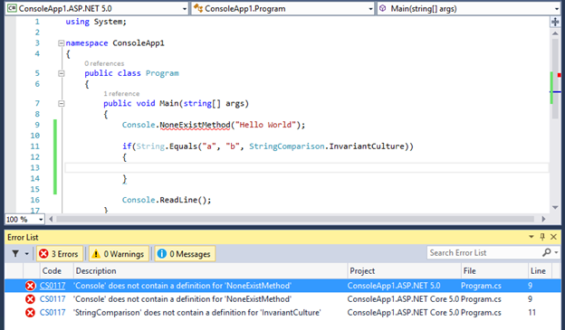
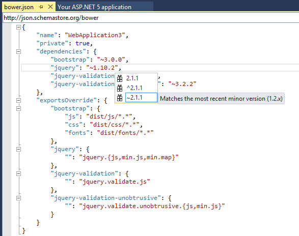
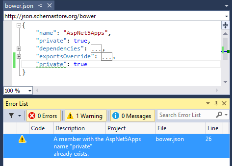

<properties
    pageTitle="ASP.NET and Entity Framework"
    description="Both ASP.NET 5 and Entity Framework 7 have been designed to be ready for cloud deployments by reducing its memory footprint and increasing its throughput. Both are also open source and cross platform and are able to run on the traditional .NET Framework 4.6 and the new cloud-optimized .NET Core 5."
    slug="servernetfx"
    order="200"    
    keywords="visual studio, vs2015, vs, visualstudio, cross-platform, server, linux, windows"
/>

The latest version of the .NET Framework includes the next-generation JIT compiler, CLR performance improvements, DateTime to Unix time support, garbage collector updates, cryptography updates, and compatibility switches. Details can be found on the [.NET Framework 4.6](../../windows/windowsnetfx) topic and also [.NET Core](netcore).  

## ASP.NET 5

ASP.NET 5 is the Web stack for .NET in Visual Studio 2015. It unifies MVC, Web API and Web Pages into a single API called MVC 6. In addition to working with ASP.NET 5 in Visual Studio, you can also try the more command-line-oriented approach, by checking out the ASP.NET home repo, to build apps on Windows, Linux or Mac.

ASP.NET 5 has the following overall characteristics:

- Full support for both C# and Visual Basic (including Visual Basic with ASP.NET 4.6)
- ASP.NET MVC and Web API, which have been unified into a single programming model.
- A no-compile developer experience.
- Environment-based configuration for a seamless transition to the cloud.
- Dependency injection out-of-the-box. 
- NuGet everything, even the runtime itself.
- Run in IIS, or self-hosted in your own process.
- All open source through the .NET Foundation, and takes contributions in GitHub.
- ASP.NET 5 runs on Windows with the .NET Framework or .NET Core.
- .NET Core is a new cloud optimized runtime that supports true side-by-side versioning.
- ASP.NET 5 runs on OS X and Linux with the Mono runtime.

To optimize ASP.NET 5 Preview project development experiences in Visual Studio, new Visual Studio features include new templates, a new project system, combined IntelliSense to support multi-framework targeting, an updated NuGet package manager, editor improvements, runtime updates, and much more.
 

## Templates 
- **New templates:** The "ASP.NET 5 Empty" and "ASP.NET 5 Starter Web" templates are added to "New ASP.NET Project" dialog for C#. The "ASP.NET 5 Class Library" and "ASP.NET 5 Console Application" templates are also added to "New Project" dialog under "Visual C#"/Web.
- **Web project template:** The ASP.NET 5 web project template contains a layout to optimize for both static content and for package restore from NPM and Bower. The template puts static contents under the wwwroot folder that is determined by the webroot element of project.json.
- **Starter Web template and Entity Framework:** The ASP.NET 5 Starter Web template contains the code first migration for Entity Framework 7.
- **Starter Web template and command line scaffolding:** You can use command line scaffolding the ASP.NET 5 Start Web template because "gen":"Microsoft.Framework.CodeGeneration"is specified in project.json's commands element.

## Projects and Builds

- **Project.json file is used to define project information:** Visual Studio uses the project.json file for reference and package dependencies, version definitions, framework configurations, compile options, build events, package creation meta-data, and run commands, as well as other details. This way, the project can be edited and run in Linux and on MacOS machines that do not have Visual Studio.
- **Project file no longer includes project directory items and references:** ASP.NET 5 projects uses the <projectName>.kproj file as Visual Studio's project file. The .kproj file doesn't include any files from the current directory or sub-directories, as Visual Studio automatically includes and monitors the ASP.NET 5 project directory files.
- **Dependencies node for Bower and NPM dependencies:** ASP.NET projects integrate Bower and NPM into solution explorer, under a new dependencies node. You can uninstall a package through the context menu command, which will automatically remove the package from the corresponding JSON file.
- **References node displays all frameworks defined in project.json file:** In the Solution Explorer of an ASP.NET 5 Application, the References node displays all frameworks defined in the project.json file.
- **Project's property page can be used to define runtime information:** The ASP.NET 5 Application's Property Page is a tool window and can be used to specify the KRE target version, the debug target, and whether binaries and NuGet packages should be created during a Visual Studio build.
- **Fast build time with Visual Studio:** Visual Studio uses the Roslyn engine to compile ASP.NET 5 projects at design time. Therefore, the project has already been compiled when you issue a "build" request. In Visual Studio 2015 Preview, Visual Studio simply passes the design time compiler output to the build request. This avoids another build and improves performance when you build, run, or debug ASP.NET 5 projects.
- **Support xUnit tests in Test explorer:** Visual Studio supports running and debugging for ASP.NET 5 xUnit tests through test explorer. All you need to do is add the xUnit dependencies and test commands to the test project's project.json file, as shown below (NOTE: To install the xUnit packages you will need to add https://www.myget.org/F/aspnetvnext/api/v2 as a NuGet package source):
- **Support Task Runner Explorer:** Task Runner Explorer is integrated to Visual Studio, which can be enabled by selecting the gruntfile.js file's context menu item Task Runner Explorer, or via Visual Studio's menu-item View->Other Windows->Task Runner Explorer.

### Updated New Project Dialog

The addition of ASP.NET 5 as new separate version of ASP.NET gave motivation re-work the ASP.NET New ASP.NET Project dialog in Visual Studio 2015. ASP.NET 4.6 and ASP.NET 5 are clearly divided, making it easy to choose which type of app you want to build. The ASP.NET 5 section has fewer choices since more of the scenarios are integrated now. For example, you can opt to make your Web API a Mobile service at any time.

### Missing NuGet Packages - No Longer

The transition from the monolithic .NET Framework to distributing .NET Core as NuGet packages has a lot of advantages, but has come with some challenges, including package discovery. You can now resolve NuGet package references in a similar way as you can resolve missing namespace references for types.

In the example below, the XDocument type (just the text XDocument) is resolved to its type definition with a simple "CTRL .". The using statement is added to the file and the System.Xml.XmlDocument NuGet package.

This makes it easier to copy some code from a place like StackOverflow and resolve type and package references quickly and easily. 

## Editor Improvements

### IntelliSense and Error list

Visual Studio 2015 gives combined IntelliSense when showing IntelliSense in the code editor. An IntelliSense item that exists in one framework, but not in another will be listed in the IntelliSense with a warning sign. The IntelliSense tooltip indicates which framework supports it and which framework doesn't.

Build errors shows which target framework the error is from. So, if you have an error in the code that is recognized by two targeting frameworks, it will show in two places in the error and output error list, with the same description and file location, but with different project names which includes the framework name.

### JSON Editor

Visual Studio 2015 makes improvements in the JSON editor, including performance improvements such as loading JSON schema asynchronously, caching of the child schemas, and better IntelliSense. Additionally, there are the following new features:

- **JSON Schema validation:** Add JSON schema validation feature, based on the schema that is defined in the schema drop-down list.
- **Un-minify context menu:** Right-click the JSON editor and select Un-minify context menu to un-minify any long arrays in the JSON file.
- **Reload Schemas context menu:** Visual Studio caches the schema that is downloaded from Internet and will use the cache even after you restart Visual Studio. If you know the schema is changed, you can use the context menu Reload Schemas Ctrl+Shift+J to re-download the current used schema in the active JSON document, and then use it immediately on the current document.
- **IntelliSense for package.json/bower.json:** In addition to providing IntelliSense and validation for both package.json and bower.json files, Visual Studio also provides live IntelliSense for both Bower and NPM packages directly within the JSON editor

- **Duplicate property validation:** This helps catch this common problem with JSON file authoring. 

### HTML Editor

In addition to updated IntelliSense for web standards, the HTML editor in Visual Studio 2015 has the following new features:

- **Better client template formatting:** The HTML editor does not parse or format double-curly syntax {{…}}. This is to make sure that the content of that syntax is not treated as being HTML and therefore being invalidated, nor does it try to format them, which cannot be done correctly by using the HTML formatter. This is great for Angular, Handlebars, Mustache, and other double-curly template syntaxes.
- **Support for custom elements, polymer-elements and attributes:** The HTML Editor no longer validates unknown attributes for custom elements, as there will be many custom made tags in different frameworks. Therefore, there will no longer be squiggles under the unknown elements.
- **Basic IntelliSense for <link rel="import">:** part of the Web Components standard.
- **HTML element tooltips:** Tooltips are supplied for HTML elements in the editor.
- **#region support:** YOu can use region folding and also use surrounding snippets to surround the current selection.
- **Todo/Hack comment support in Task List:** The HTML editor supports Todo, Hack etc. comment token and display them in Task List.
- **Angular icons:** Both Angular directives (ex. <ng-view>) and attributes (ex. ng-controller) show in IntelliSense with an Angular logo to make it easy to identify them.
- **Bootstrap icons:** The IntelliSense provided in HTML class attributes shows the Bootstrap logo if the class name was defined by the Bootstrap CSS file.

### CSS/LESS/Sass Editor

- **Todo/Hack comment support in Task List:** The CSS/LESS/Sass editor now supports Todo, Hack etc. comment token and display them in Task List.
- **@viewport fix for LESS editor:** In LESS editor, @viewport will not show verification warning anymore.
- **Provide many more snippets:** The CSS/LESS/Sass Editor now provides more snippets to ease the development experience.

## Async Model Binding for Web Forms

In the .NET Framework 4.5, Model Binding support was added to Web Forms. In the .NET Framework 4.6, we are adding support for Async Model Binding which allow you write Asynchronous Model Binding actions. 

## HTTP/2 Support (Windows 10)

HTTP/2 support has been added to ASP.NET in the .NET Framework 4.6. New features were required in Windows, in IIS and in ASP.NET to enable HTTP/2 given that networking functionality exists at multiple layers. You must be running on Windows 10 to use HTTP/2 with ASP.NET. HTTP/2 has not yet been added to ASP.NET 5.

HTTP/2 is a new version of the HTTP protocol that provides much better connection utilization (fewer round-trips between client and server), resulting in lower latency web page loading for users. Web pages (as opposed to services) benefit the most from HTTP/2, since the protocol optimizes for multiple artifacts being requested as part of a single experience.

The browser and the webserver (IIS on Windows) do all the work. You don't have to do any heavy-lifting for your users. Most of the major browsers support HTTP/2, so it's likely that your users will benefit from HTTP/2 support if your server supports it. 

## Support for Token Binding Protocol

Microsoft and Google have been collaborating on a new approach to authentication, called the Token Binding Protocol. The premise is that authentication tokens (in your browser cache) can be stolen and used by criminals to access otherwise secure resources (e.g. your bank account) without the requirement of your password or any other priviliged knowledge. The new protocol aims to mitigate this problem.

The Token Binding Protocol will be implemented in Windows 10, as a browser feature. ASP.NET apps will participate in the protocol, such that authentication tokens are validated to be legitimate. The client and the server implementations establish the end-to-end protection specified by the protocol.

## ASP.NET Model Binding supports Task returning methods

ASP.NET Model Binding methods that were previously returning Task were not supported and threw an exception at runtime. With .NET Framework 4.6, if applications are deployed with such methods, these methods are be executed correctly.

## Other Tooling Updates

- **Browser Link: CSS automatically synchronous:** Saving a CSS file or changing it externally (such as by using a LESS/SASS compiler) causes the whole CSS file to reload in the browser. If the file is in a state where it cannot auto-sync, Ctrl + S will cause an automatic reload, and this should put it back into a good state without having to refresh the linked browsers (Ctrl + Alt + Enter). The feature can be disabled in the toolbar.
- **WebJobs Tooling:** Visual Studio supports controlling web jobs through Server Explorer WebJobs' node inside an Azure Website in the following ways:
   - View WebJobs nodes underneath Website nodes in Server Explorer.*
   - Start/Stop Continuous WebJobs from Server Explorer.
   - Run On-demand or Scheduled jobs from Server Explorer.
   - View WebJob Dashboard from Server Explorer.
   - View Dashboard context menu comments goes to the WebJob Dashboard on Azure.
- **WebJobs SDK:** The WebJobs SDK is pre-installed with the Azure WebJob project templates. 

## ASP.NET runtime updates

- **Microsoft ASP.NET and Web ASP.NET MVC 5.2.2: ** Template packages are updated to use ASP.NET MVC 5.2.2. This release does not have any new features or bug fixes in MVC. We made a change in Web Pages for a significant performance improvement, and have subsequently updated all other dependent packages we own to depend on this new version of Web Pages.
- **ASP.NET Web API 5.2.2:** In this release we have made a dependency change for Json.Net 6.0.4. For more information on what is new in this release of Json.NET, see Json.NET 6.0 Release 4 - JSON Merge, Dependency Injection. This release does not have any other new features or bug fixes in Web API. We have subsequently updated all other dependent packages we own to depend on this new version of Web API.
- **ASP.NET Web API OData 5.3.1:** See the [release notes](http://www.asp.net/web-api/overview/releases/whats-new-in-aspnet-web-api-odata-53)for details. 
- **SignalR 2.1.2:** Template packages use SignalR 2.1.2. For more information, see the [SignalR 2.1.2 release notes on GitHub](https://github.com/SignalR/SignalR/releases/tag/2.1.2).
- **Microsoft Owin 3.0 Package:** Template packages use Microsoft Owin 3.0 NuGet packages. For more information, see the [Katana 3.0 release notes](https://katanaproject.codeplex.com/releases/view/113283).
- **NuGet 2.8.3:** Supports DevExtreme project and BizTalkProject are added to 2.8.3. For more information, see the [NuGet 2.8.3 release notes](http://docs.nuget.org/docs/release-notes/nuget-2.8.3).
- **ASP.NET Identity 2.1.0:** Added SignInManager to make it easier to use security features such as Account Lockout, and Two-Factor Authentication for login. For more information, see Announcing RTM of ASP.NET Identity 2.1.0.

### Entity Framework 6.1.3

EF6.1.3 is the latest stable version of Entity Framework and is the recommended version for production applications. EF6.1.3 is a patch release containing fixes for high priority issues that were reported on EF6.1.2. Visual Studio 2015 RC includes the RTM version of Entity Framework 6.1.3 runtime and tooling.

The EF runtime will be installed if you create a new model using the Entity Framework Tools in a project that does not already have the EF runtime installed.

The runtime is pre-installed in new ASP.NET projects, depending on the project template you select. The EF6.1.3 Tools for Visual Studio 2015 are included to make sure you get the latest bug fixes and improvements.

### Entity Framework 7

EF7 introduces some significant changes and improvements over EF6.x and therefore the pre-release phase of EF7 is much longer than other recent releases. We’ve made significant progress since our last pre-release, but if you decide to try out EF7 then please bear in mind that this preview is designed to give you an idea of what the experience will be like and there are still a number of limitations and missing features that will be addressed before RTM.

EF7 can be used in the .NET Framework, .NET Core (including ASP.NET 5) and Mono apps.

- Basic modeling including built-in conventions, table/column mapping, and relationships
- Change tracking
- LINQ queries
- Table based Insert/Update/Delete (including batching)
- Migrations and database creation/deletion
- Transactions (including automatic transactions during SaveChanges and explicit transaction APIs)
- Identity and Sequence patterns for database generated key values
- Raw SQL commands
- An early preview of reverse engineering a model from a database
- Logging
- Unique constraints including the ability to use them as keys in a relationship
