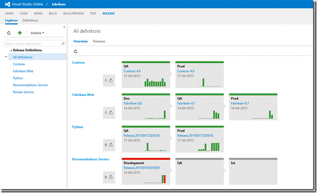
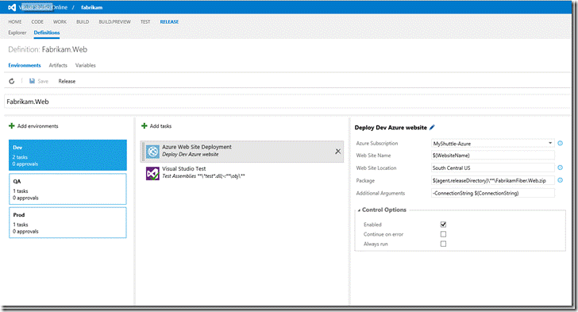
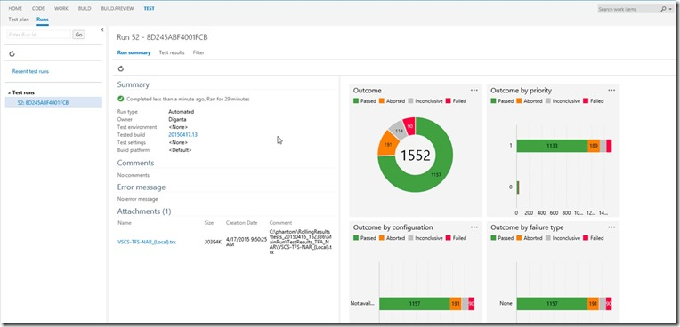

<properties
    pageTitle="Deployment and Release Management"
    description="TODO"
    slug="releasemanagement"
    order="500"    
    keywords="visual studio, team foundation server, visual studio online, vs2015, vs, visualstudio, tfs, vso"
/>
## Deployment

We've been working to more loosely couple our deployment automation capabilities with our Release Management feature.  In this change we’ve combined our build automation pipeline and deployment pipeline, using the same extensibility model for both.  That means the same deployment tasks can be seamlessly used as part of a simple build/deploy workflow or as part of a larger release management workflow with multiple deployments, validations, approvals, etc.  This greatly simplifies our story and improves flexibility.

Work we’ve done in deployment includes:

 - **Deploy to cloud or on premises:** You can deploy applications both to cloud and on premises environments.
 - **Auto-provision cloud environments:** Using Azure, you can automatically provision the hardware as part of the deployment process.  Ultimately we’ll enable this on prem as well by bringing it together with our existing lab management capabilities on top of SCVMM.
 - **Support for deployments to any platform:** You can use our deployment tasks to orchestrate cross platform deployments with either Chef or Powershell DSC on Linux.
 - **Docker support:** We have support for doing deployments using Docker.

## Release Management Preview

If you need a deployment solution that goes beyond just simply auto deploying as part of a build, our release management capabilities will give it to you.  With release management, you can orchestrate deployments across multiple environments, perform validations and approvals at each stage, track what versions of your app are deployed in each environment, manage configuration differences between the various environments, and more.

Today, we have a release management solution that is available with both VS Online and TFS 2013.  We're continuing to support that solution but, at the same time, working on some significant improvements that improve openness, cross platform support, ease of use and deliver on the next set of capabilities customers have been asking us for.

- **Browser based release management experience:** We're introducing a "Release" hub in our web experience that allows you to manage releases from anywhere without any client software installed.
 

- **Orchestrate across multiple environments:** A release definition can describe a set of environments, a deployment sequence and a set of validations (like automated tests) and approvals that are executed at each stage.  This allows you to manage the flow of updates from check in through to production deployment in a controlled fashion.

- **Simple and easy to compose automation pipeline:** Release management uses the same simple, extensible pipeline and task mechanism that Build.vnext does but wraps it in an experience for release pipelines.

### Web Interface

<TODO>

### Integration with Build.Preview

<TODO>

### Integration with Other Build and Deployment Systems

<TODO Jenkins, Chef, Docker, or Azure resource groups, plus deploy to on-premises servers from Visual Studio Online.>

### Release validation

Testing plays a critical role in any modern DevOps release pipeline.  Above, as part of build, we've talked about running automated unit tests and reporting results but a proper validation needs to run tests against the deployed application as well.  We’re doing a bunch of work both in TFS 2015 and on VS Online to enable these scenarios easily.

- **Functional testing service:** We have a new service that works in concert with release management to automatically deploy test agents and tests.  It will then execute those tests, possibly in parallel and report the results back to TFS/VSO.  These functional tests can be VS Coded UI tests, Selenium tests, Appium tests and more…  The results of these tests can be used in the release pipeline to automatically validate deployments.

- **Load tests:** We now support running load tests as part of the release management pipeline so that you can validate performance, scale and reliability as part of your automated release sign-off process.  We’ve recently upgraded the VSO cloud load test service to support runs of up to 200 cores, enabling very large scale load tests.

- **Test analysis:** We’ve provided a new test analysis experience in the test hub that allows you to review/investigate test results, file bugs, etc.  This is linked directly from the test results you find in both the build and release reports.

