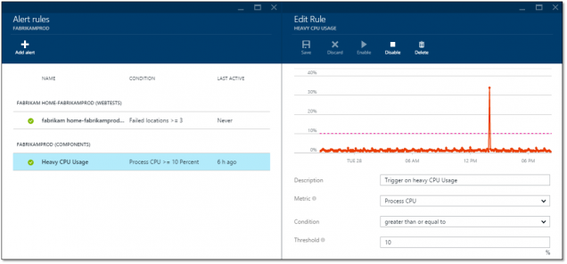
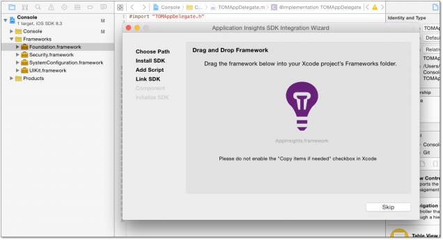

<properties
    pageTitle="Application Insights Preview"
    description="Detect issues, diagnose crashes and track usage in your mobile and web apps on Azure, IIS, and J2EE"
    slug="appinsights"
    order="600"    
    keywords="visual studio, visual studio online, vs2015, vs, visualstudio, vso, application insights, app insights, telemetry, monitoring, analytics"
/>
Application Insights is an analytics solution for any app that brings together Application Performance Management and Usage Analytics. This provides development teams with a comprehensive 360° view of performance, availability, and usage across all their live applications, which includes immediate alerts on issues.  With intuitive views and powerful tools for fast troubleshooting and diagnostics, it also helps you analyze user activity and adoption, so that you can prioritize future work accordingly.

Application Insights has reached the public preview milestone with new capabilities that complement existing support for cloud-based and Windows-based apps by integrating [HockeyApp's](http://hockeyapp.net/features/) cross-platform capabilities to deliver crash analytics for iOS and Android apps.

Application Insights is available for use through the [Azure portal](http://azure.microsoft.com/en-us/services/application-insights/).

## Platform Support

Application Insights supports a wide range of app types running on devices, servers, or desktops.
 
- Web apps: ASP.NET, Azure Cloud Services, Java, Node.js, PHP, Python, Ruby, Joomla, SharePoint, and WordPress, as well as client-side JavaScript. 
- Hosts: Azure, J2EE, or your own on-premises servers running IIS.
- Android, iOS, and Windows mobile apps; Windows support covers Windows Phone, Windows Store, Windows 10 universal apps, and direct integration with the Windows 10 developer portal.
- Windows desktop apps

Application Insights also supports getting telemetry from existing ASP.NET web apps on IIS without redeploying.

## 360° Views across Availability, Performance, and Usage

[According to Gartner](http://www.gartner.com/newsroom/id/2669915), the need for a complete view across availability, performance, and usage is ranked as one of the Top 10 mobile technologies and capabilities organizations must master in 2015-2016. With Application Insights you can achieve an integrated view from every angle across your entire application stack and even across multiple platforms in one place.

You can trace user paths through your scenarios with [custom instrumentation](http://azure.microsoft.com/documentation/articles/app-insights-custom-events-metrics-api/) and can take advantage of powerful drill down capabilities, slicing and dicing your data, [filtering and segmenting](http://azure.microsoft.com/documentation/articles/app-insights-metrics-explorer/) it and [searching specific instances](http://azure.microsoft.com/documentation/articles/app-insights-diagnostic-search/), allowing you to answer questions such as:

- Do I have performance bottlenecks?
- Am I attracting new users faster or slower than last month?
- How were my users impacted by service performance issues?
- Which user segments were impacted the most?

Application Insights also provide continuous data export to Azure blob storage for any custom analysis you want to do.

## Fast and Powerful Troubleshooting and Diagnostics

You can’t afford downtime in your application or service. As a developer or service engineer, you have to identify issues before they impact your business. The tools in Application Insights let you identify and diagnose issues as soon as they occur.

Real-time mobile crash analytics allows you to get crash details from the device, understand what happened leading up to the crash, and prioritize fixes based on customer impact. For your web applications, you can diagnose failed requests, exceptions & dependency failures, and even correlate with your [trace logs](http://azure.microsoft.com/documentation/articles/app-insights-search-diagnostic-logs/) & [custom events](http://azure.microsoft.com/documentation/articles/app-insights-custom-events-metrics-api/) for deeper context.

For web apps, you can [set up alerts](http://azure.microsoft.com/documentation/articles/app-insights-set-alerts/) based on [web tests or URL pings](http://azure.microsoft.com/documentation/articles/app-insights-monitor-web-app-availability/) and define your own metrics-based thresholds so that you know about abnormal service behaviors before they impact customers.

 

## Built-In Analytics for Any App with Single-Click Instrumentation

We have designed Application Insights to be an integral part of your development process and have made it easy to add to both new and existing applications, even if they are [already live in production](http://azure.microsoft.com/documentation/articles/app-insights-monitor-performance-live-website-now/). It collects vital application data automatically with practically no effort, and is already part of your development workflow if you are using Visual Studio.

This single-click instrumentation in VIsual Studio is available for Windows, ASP.NET, and WCF projects.
 
We take the same approach across a variety of IDEs: Eclipse, IntelliJ, Android Studio, and XCode. Here’s the equivalent tool in Xcode:

 
As you’ve seen, the Application Insights portal provides a range of powerful analytic and search tools that you can apply to the stream of telemetry data from your apps. In addition, you can [export data](http://azure.microsoft.com/documentation/articles/app-insights-export-telemetry/) to external systems to let you mashup your telemetry with other data sources and perform further analysis.

## Resources 
- [Application Insights Documentation](http://azure.microsoft.com/en-us/documentation/services/application-insights/)
- [Azure portal](http://azure.microsoft.com/en-us/services/application-insights/).
- [Application Insights on visualstudio.com](http://azure.microsoft.com/en-us/services/application-insights/)
