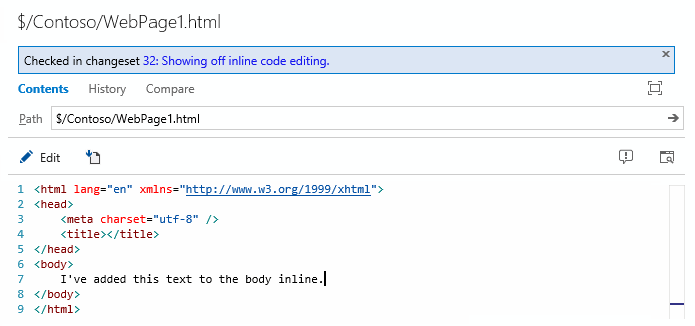
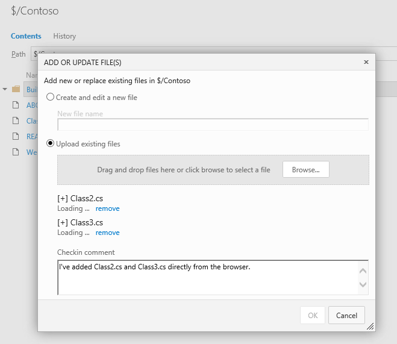
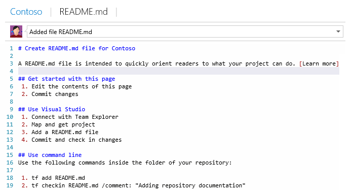

<properties
    pageTitle="Version Control"
    description="Planning, tracking, and executing on work is the heart of any agile process, and we continue to make the process more efficient."
    slug="sourcecontrol"
    order="267"    
    keywords="visual studio, team foundation server, visual studio online, vs2015, vs, visualstudio, tfs, vso"
/>

##Quick code editing

You can make a quick edit to a file in version control directly from your web browser and then commit those changes straight back to the service. When browsing a source file, an Edit command puts the file into editing mode. Changes can then be made inline, complete with color coding and formatting support. As soon as you click the Save command, we create a new commit/changeset with your changes. Use the diff view to see exactly what changes you’re making before committing the changes. If the file is a Markdown or HTML file, you can also preview your changes before you save them.

You can also add, delete and rename files directly from the web. To add a new file (or files), right-click a folder in your repository, select Add file(s), enter your check-in/commit comment, and you're ready to go. The days are gone when you have to download your entire codebase just to rename or delete a file.

The editing capabilities also show up in the Welcome hub, making it easy to create documentation for your projects. If you don't have a README.md file, you can start with our template guide and commit your own.

You're also able to create links to existing (or new) markdown files by following the syntax. Don't worry if the page doesn’t exist, because you can edit and commit the new file when you click the link, wiki-style.

## Code review policies

Git projects can now set branch policies to require code reviews for any code submitted into a branch. Enabling the code review policies for a branch will enforce that all code must be submitted to that branch using pull requests. The policies provide options to require a minimum number of code reviewers, as well as to require specific reviewers for particular paths and/or file types.

## Code Policies - Gated Build

Git projects can now set branch policies to require a successful build before any code can be submitted into a branch. Enabling the build policy will require the use of pull request to submit changes into the configured branch, and completion of the pull request will be gated upon the successful outcome of the configured build. 

## History control

We have optimized the history control to make discussions easier to read. Specifically, we’ve reduced the vertical space required so that you can get to the discussions you want to see more quickly, and we’ve done this without reducing functionality.

## View history on a folder

Now, you can right click on any folder in Solution Explorer, the Changes page, or the Commit Details page, and get the history of changes to files within that folder. 

## Branch history (pushes & pull requests)

In the web portal, the History hub under CODE has been updated to support a new view for Git projects. The new "Branch Updates" view shows all of the updates for a given branch, and groups commits by Push and Pull Request activity. This view provides developers a new insight into how their Git repo is being updated over time, and provides traceability from History to Pull Requests.

## Improved merge performance

We have improved merge performance, which is especially apparent on large repos.
