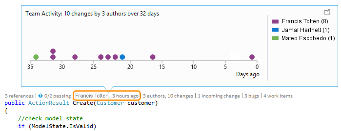
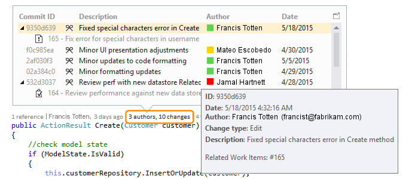
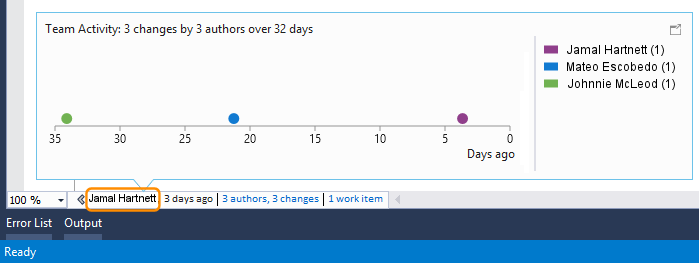
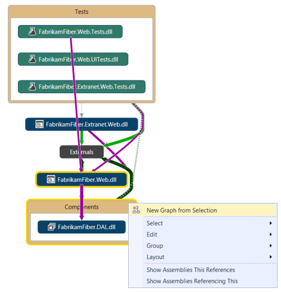
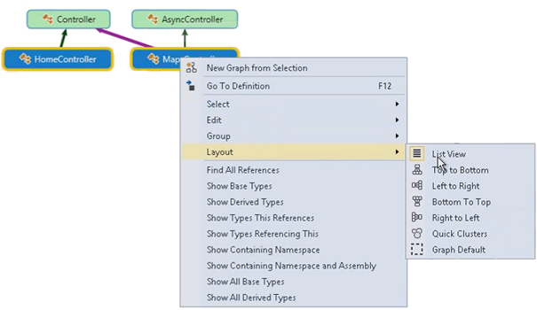

<properties
    pageTitle="Code Visualization"
    description="Updates to CodeLens and Code Maps provide more insights into your code."
    slug="codeviz"
    order="300"    
    keywords="visual studio, vs2015, vs, visualstudio, productivity, ide, code visualization, codelens, code maps, layer diagrams, UML diagrams, modeling, architecture"
/>

## CodeLens

Find out more about your code, while staying focused on your work in the editor. Find code references, changes to your code, related TFS items, and unit tests – all without looking away from the code. 

For Visual Studio 2015, we have replaced the CodeLens "Authors" indicators with the new "Team Activity Timeline" and "Authors and Changes" history indicators. 
- The **Team Activity Timeline indicator** shows the last author, and when the last change was made. Choosing this indicator opens **Team Activity View**, where you can look for patterns in changes to the code. This can help you to assess the impact of changes over time.
- The **Authors and Changes indicator** shows the number of authors that have changed the file, and the number of changes. Choosing this indicator opens a list of all the changes, details of the changes, and links to get more information and see the previous versions.

All the information from the indicators is available when your code is hosted in Team Foundation Version Control (in both Team Foundation Server and Visual Studio Online) and in Git repositories. When you are working in Team Foundation Server or Visual Studio Online, you can also get information about work items.

These indicators, together with the indicators available in previous versions, are displayed at the code element (method, field, or class) level for C# and Visual Basic files. The following is an example of the Team Activity Timeline indicator for a C# file: 

The following is an example of the Authors and Changes indicator for a C# file:

The indicators are also displayed at file level for all other types of files (for example, C++, SQL, JavaScript, and other types of files). The following is an example of the Team Activity Timeline indicator for a file that is not a C# or Visual Basic code file:

## Code Maps and Dependency Graphs

When you want to understand specific dependencies in your code, visualize them by creating **Code Maps**. You can then navigate these relationships by using the map, which appears next to your code. Code maps can also help you keep track of your place in the code while you work or debug code, so you'll read less code while you learn more about your code's design.

The shortcut menus for code elements and links are easier to use in Visual Studio 2015 by grouping commands into sections related to selecting, editing, managing groups, and changing the layout of group contents. Notice also that test projects are displayed in a different style from other projects, and that we updated the icons for elements on the map to more appropriate versions. 

 
Contents of code elements are displayed so that you can select more than one group and apply the layout style you want to all of them. You can always get a useful dependency diagram when you expand an assembly, a namespace, or a type on a code map.

New features for Visual Studio 2015:

- **Skip rebuilding your solution** for better performance when creating and editing diagrams.
- **Get reactive Code Maps more quickly:** Drag and drop operations produce an immediate result, and the links between nodes are created much more quickly, without affecting subsequent user-initiated operations such as expanding a node or requesting more nodes. When you create Code Maps without building the solution, all the corner cases—such as when assemblies are not built—are now processed.
- **Create diagrams from the Class View and Object Browser**
- **Filter relationships** to make diagrams easier to read. Link filtering also applies to cross group links, which makes working with the filter window less intrusive than it was in previous releases.
- **Quickly unclutter your Code Maps** by filtering for nodes and groups. You can show or hide code elements on a map based on their category, as well as group code elements by solution folders, assemblies, namespaces, project folders, and types.

Other improvements include:

- **Dependency links** no longer represent the inheritance from System.Object, System.ValueType, System.Enum, and System.Delegate, which makes it easier to see external dependencies in your code map.
- **Improved top-down diagrams:** For a medium to large Visual Studio solutions, you can  use a simplified Architecture menu to get a more useful Code Map for your solution. The assemblies of your solution are grouped alongside the solution folders, so you can see them in context and leverage the effort you've put in structuring the solution. you'll immediately see project and assembly references, and then the link types appear. Also, the assemblies external to your solution are grouped in a more compact way. *Note*: You can no longer use Architecture Explorer to create these diagrams. But you can still use Solution Explorer.
- **'drill-in into dependency links'** take filters into account. You now get a useful clear diagram when requesting to understand the contributions to a dependency link in Code Map. This diagram is less cluttered, and it also takes into account the link filtering options.
- **Code elements are added to a code map with their context:** Because diagrams appear with their context (up to the assembly and solution folder), which you can filter out, you can get more useful diagrams when dragging and dropping code elements from the solution explorer, class view, object browser, or when requesting Show on Code Map.
- **Test Projects are styled differently and can be filtered:** You can identify test projects on a Code Map for Solution as they are styled differently. They can also be filtered out so that you can more easily focus on product code.

## Layer diagrams

- **Update layer diagrams using the Class View and Object Browser:** To meet software design requirements, use layer diagrams to describe the desired dependencies for your software. Keep code consistent with this design by finding code that doesn’t meet these constraints and validating future code with this baseline.

## UML diagrams

You can no longer create UML class diagrams and sequence diagrams from code, but you still create these diagrams using new UML elements.
