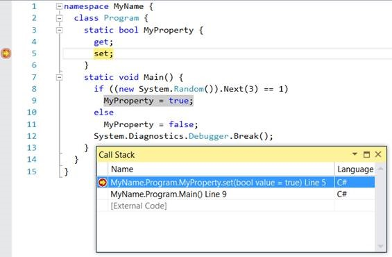
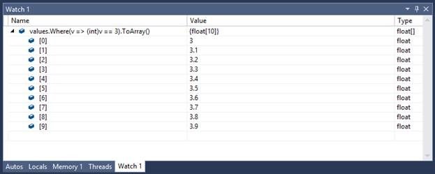
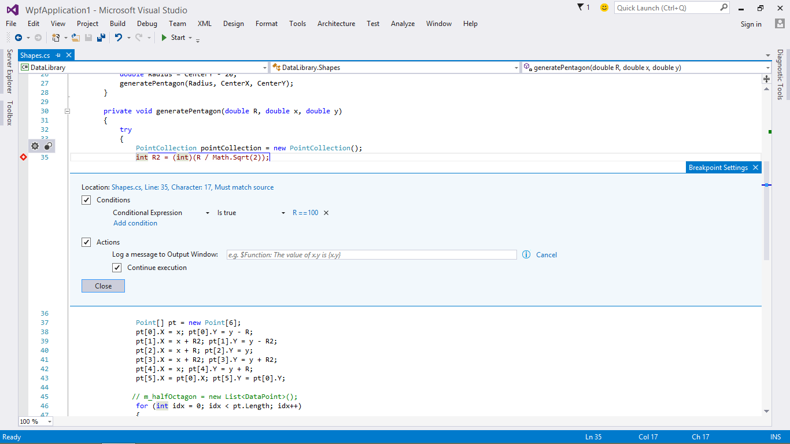

<properties
    pageTitle="Debugging & Diagnostics"
    description="Visual Studio 2015 greatly improves the range of tools that you have for debugging and diagnostics. These include PerfTips, improved breakpoint configuration. lambda debugging support, filtering for errors and warnings, and much more."
    slug="debugdiag"
    order="200"    
    keywords="visual studio, vs2015, vs, visualstudio, productivity, ide, debugging, diagnostics, perftips, intellitrace"
/>

## PerfTips

PerfTips bring performance awareness into the debugging experience by indicating elapsed time for one or more lines of code as they are run in the debugger. This saves tremendous time over running separate diagnostic tools and navigating the output.

## Breakpoint Configuration

The Breakpoint Settings window allows you to specify conditions and actions for your breakpoints. The window includes improved IntelliSense support for breakpoint conditions and actions. You can use undo (CTRL+Z) to restore deleted breakpoints. 

Breakpoint configuration in the Peek Definition window also  greatly simplifies configuring breakpoints with conditions and actions. The modeless UI allows developers to go back and forth between code and breakpoint configurations.

## Setting breakpoints on auto-implemented properties
 
Auto-implemented properties are a great convenience feature and this they have been around for a long time. However, there was no debugger support, until Visual Studio 2015, which allows you to now set breakpoints in auto-implemented properties and step through the property:

## Lambda debugging support

Lambda support includes in the Immediate and Watch windows. Edit and Continue in the debugger also works with lambdas and async functions.

## Filter errors and warnings

Filtering makes it easier for developers to prioritize corrections. Visual Studio 2015 also includes links on error codes to help developers quickly find the information needed to resolve those errors.

## GPU Usage

The GPU Usage tool can be used to understand GPU usage of DirectX applications. Frame Time, Frame Rate, and GPU Utilization graphs are available while the applications are running live. In addition, by collecting and analyzing detailed GPU usage data, this tool can provide insights into the CPU and GPU execution time of each individual DirectX event, and therefore can be useful to determine whether the CPU or GPU is the performance bottleneck.

## Improvements in the C++ Debugger 

When the C++ debugger is stopped at breakpoints, it can execute code in order to compute results, such as to show you data in the Watch and Immediate windows. If the debugger detects that a called function is deadlocked, it will attempt to resolve the issue.

When a C++ debugger launches a process, Windows now allocates memory using the normal heap rather than the debug normal heap. This results in a faster start for debugging. For more information, see [C++ Debugging Improvements in Visual Studio 2015](http://blogs.msdn.com/b/vcblog/archive/2014/10/06/debugging-improvements.aspx).

## Managed Edit and Continue on Attach

You can edit and continue when you attach to .NET applications and when the environment variable complus_forceenc is set to 1 in the target process.

## UI debugging tools for XAML

We've added two new tools—the Live Visual Tree and the Live Property Explorer—that you can use to inspect the visual tree of your running WPF or Windows Store app, as well as the properties on any element in the tree. For details, see the page on [XAML tooling](../../windows/xamltooling). 

## Exception Settings

You can configure debugger exception settings by using the Exception Settings tool window. The new window is non-modal and includes improved performance, search, and filter capabilities.

 

## Timeline Tool

The Timeline tool, which is in the Performance and Diagnostics hub, shows you how much time your application spends in preparing UI frames and in servicing networks and disk requests, and it does so in the context of scenarios such as Application Load and Page Load. 

The Timeline tool provides you with a scenario-centric view of the resources that your applications consume, which you can use to inspect, diagnose, and improve the performance of your WPF and Windows Store 8.1 applications.

  

## Diagnostics Tools

Visual Studio 2015 has updated the diagnostic tools window with Debugger Break events, Memory Usage tool, and CPU Usage graph, all integrated with the debugger and available during regular debugging sessions. 

- **Debugger Events (with IntelliTrace):** Gives you access to all Break, Output, and IntelliTrace events collected during your debugging session. The data is presented both as a timeline and as a tabular view. The two views are synchronized and can interact with each other.
- **Memory Usage:** allows you to monitor the memory usage of your app while you are debugging. You can also take and compare detailed snapshots of native and managed memory to analyze the cause of memory growth and memory leaks.
- **CPU Usage:** The CPU Usage tool allows you to monitor the CPU usage of your application while you are debugging.
- **Just my code:** When you press F5 to launch the debugger, it will show only your code so that you can understand performance issues and exceptions without noise from framework and other code. Because this code filtering functionality in IntelliTrace suppresses system code and exposes only user code, it makes it easier for you to debug "just my code."

- **Additional Improvements:**
   - It can be moved to any window location within Visual Studio and remembers its location and size between debugging sessions
   - It appears and shows data for a single process when attaching to a process using Debug > Attach to process
   - It appears when debugging ASP.NET projects, and other ASP.NET projects running on IIS   
   - It appears when debugging an app running on a remote Windows desktop device
   - Memory snapshots can be viewed after you stop debugging
   - Debugger Events (break events only) are available when debugging native projects

### Network Diagnostic Tool

This tool helps you diagnose network-related issues when building Windows store apps as well as universal apps that run across all Windows 10 devices, from Windows Phone to Xbox and Windows Store.

The network diagnostic tool records information about your app’s HTTP network operations,  including HTTP request and response headers, request and response payloads, cookies and  detailed timing information, and more. The network diagnostic tool can also help answer questions about common scenarios, such as:

- Authentication related issues (for example, why you're not able to access a resource)  
- Cache related issues (for example, why you're not getting the latest version of a resource)  
- How many bytes are downloaded when running common tasks of your apps  
- Where are the bottlenecks when accessing and downloading a resource  

To access the Network tool, open the Diagnostics Tools window in Visual Studio 2015.  On the Debug menu, select Start Diagnostic Tools without  Debugging.  Alternatively, just press Alt+F2.

