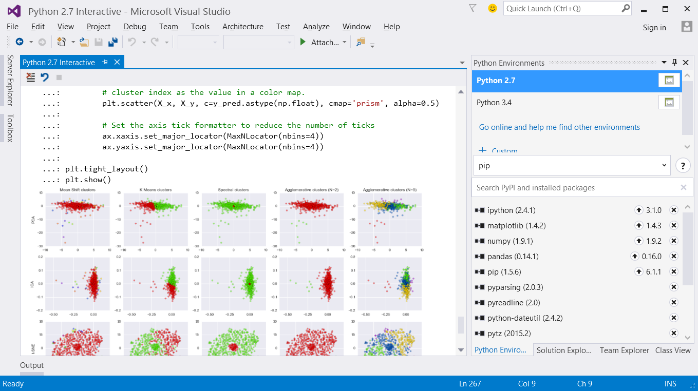
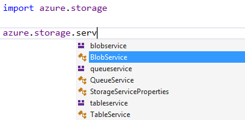
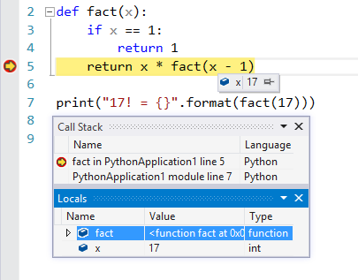
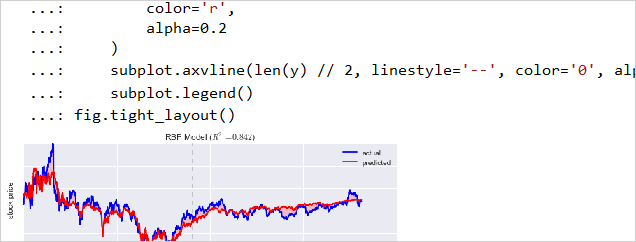
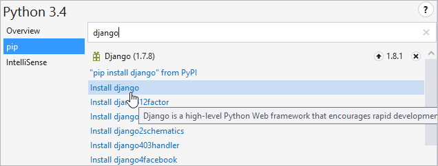
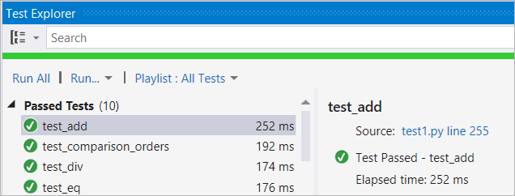

<properties
    pageTitle="Python Tools"
    description="Python is a programming language that you can run on various platforms including Windows, Linux, Unix, and Mac OS X. With Python Tools for Visual Studio, developers can take advantage of an official Microsoft open-sourced extension that enables first-class Visual Studio tooling support for Python projects."
    slug="python"
    order="600"    
    keywords="visual studio, vs2015, vs, visualstudio, cross-platform, server, linux, windows, languages, python"
/>

The Python Tools for Visual Studio is a free, open-source extension adds all the functionality you need to develop and maintain your Python applications in Visual Studio, and deploy to Windows or Linux servers, or to Microsoft Azure.

Recent updates include:

- Code snippets support
- Improved code outlining
- Improved Python environments window
- Automatic code suggestions as you type
- Debugger autos window
- Set environment variables in project settings
- Hit count breakpoints
- Task comments
- Preliminary support for Python 3.5
- Along with many bug fixes and smaller features enhancements.

The tools can be automatically installed with Visual Studio 2015 by checking the Python Tools for Visual Studio box under the Programming Languages option.

[TODO: Steve--do you have a simple screenshot for this?]  

## Key Features

### Bring your own Python

Python Tools for Visual Studio works best with [CPython](http://www.python.org/), but you can also use [IronPython](http://www.ironpython.net/), PyPy, and other programs that host Python. Or download a Python distribution bundle like [Anaconda](https://store.continuum.io/cshop/anaconda/) or [Canopy](https://www.enthought.com/products/canopy/) and start exploring the Python library ecosystem.

### IntelliSense

Powerful IntelliSense in Visual Studio understands Python and provides useful tooltips, code completion, and code snippets for your own code and any libraries you are using.

### Debugging

Python support in Visual Studio’s interactive debugger means you can enjoy stepping through your code with breakpoints, visualizers, and automatic exception notifications. Get to the root of problems quickly and easily with familiar Visual Studio tools. Advanced features include mixed mode (Python/C++) debugging and cross OS (Linux/MacOS) debugging.

### Iterate quickly with the Interactive Window

The Interactive Windows brings the power of Visual Studio to the familiar Python interactive REPL so you can quickly iterate while developing. The Interactive Window immediately executes your code, showing the output, errors, graphs and images. Integration with [IPython](http://www.ipython.org/) and [matplotlib](http://matplotlib.org/) makes it a powerful data manipulation platform.

### Find and install the libraries you need

Third-party libraries are the fastest way to solve your problems. Use our pip, PyPI and virtual environment support to manage your projects and dependencies

### Source control via Git and TFS without a command line

Manage your Git/TFS projects, pending changes, and branches with ease using Team Explorer, or check out one of the many source control extensions available for Visual Studio.

### Unit Tests

The Python Tools for Visual Studio allow you to view, edit, run, and debug unit test-style tests for Python within the Test Explorer. This helps you make sure your code is working correctly without leaving Visual Studio.

### Integrate with Azure

Visit the Microsoft Azure Python Developer Center for tutorials and documentation to get started. The free, open-source Python Azure SDK is an easy way to start using the Azure Management, Storage and Service Bus services directly from your Python code. Access the Azure availability, performance and usage tools by using the Application Insights SDK for Python. Include the Azure DocumentDB service in your project by using azure-documentdb-python. Use Azure Active Directory for OAuth authentication on a Python web site by following the example in azure-python-authenticate.

### Create instant web sites

Create, test, and deploy web sites written with Python and debug them from your desk while they run on your Linux or Windows-based server or on Microsoft Azure.

